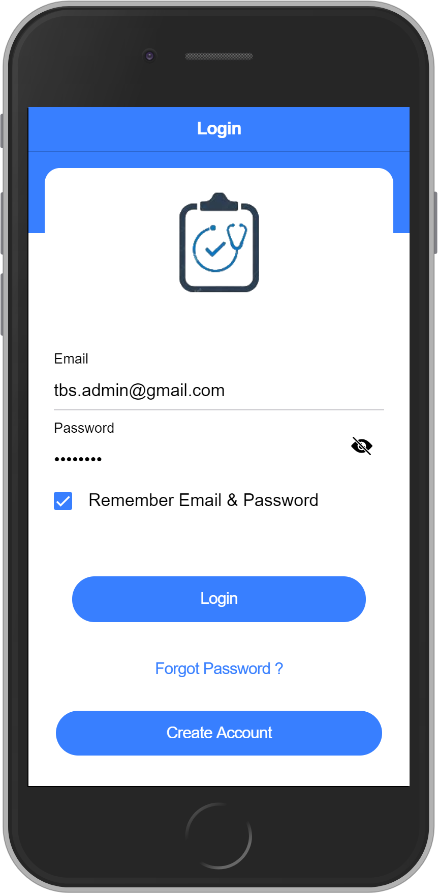
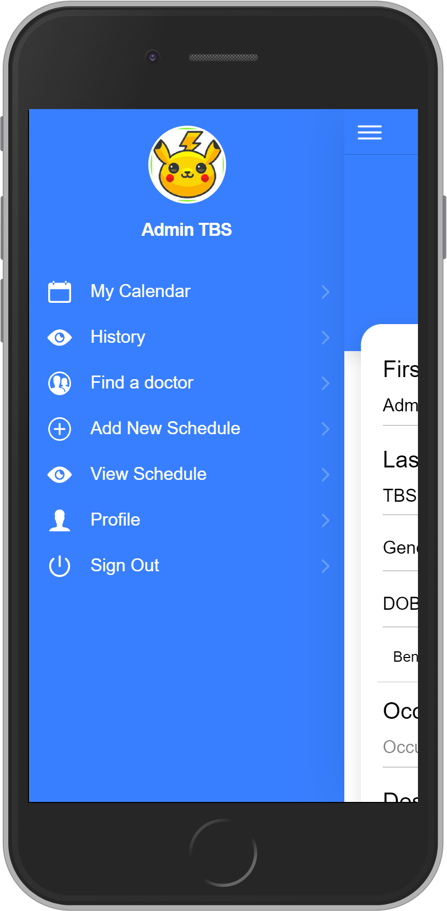
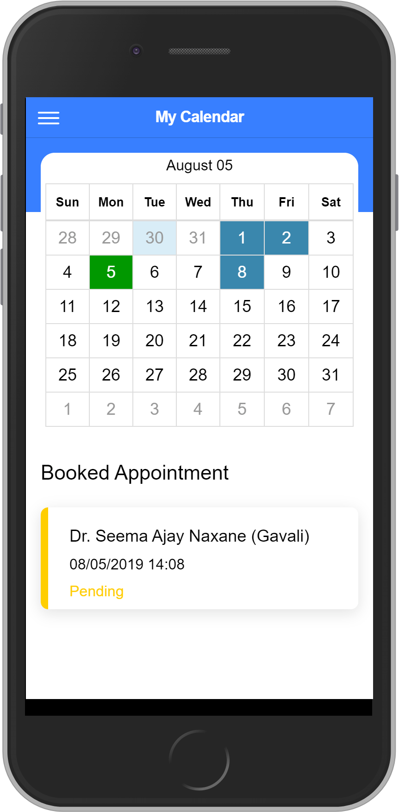
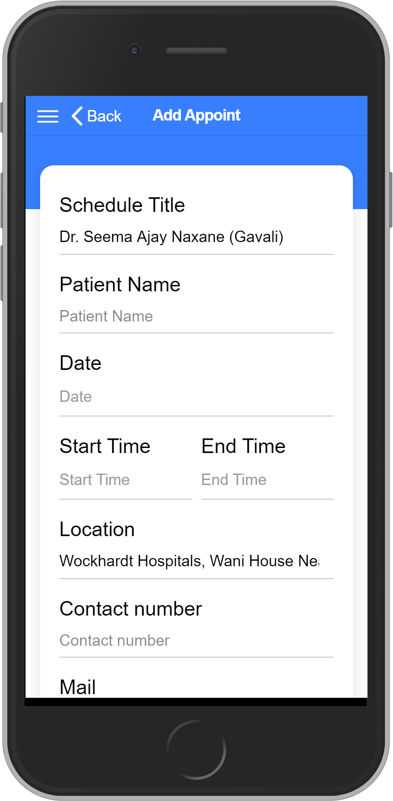
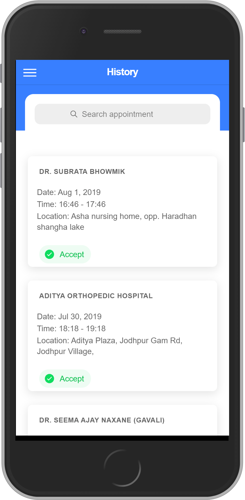
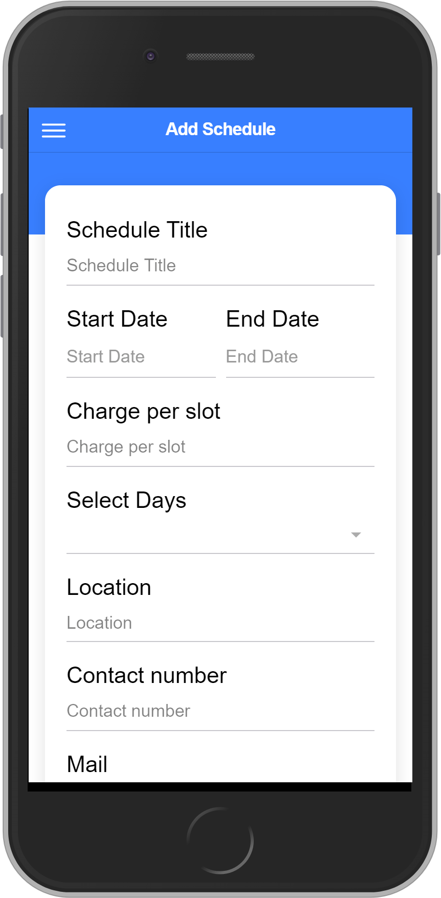
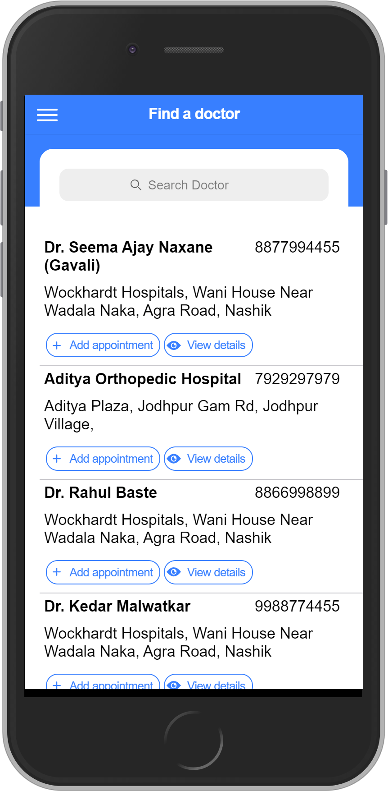
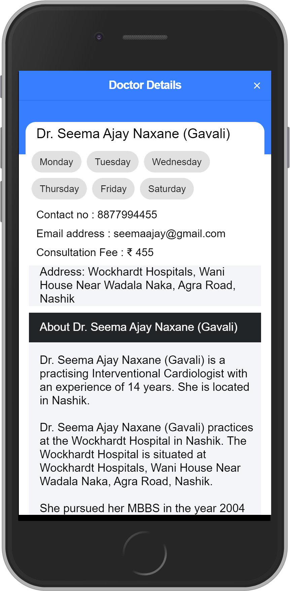
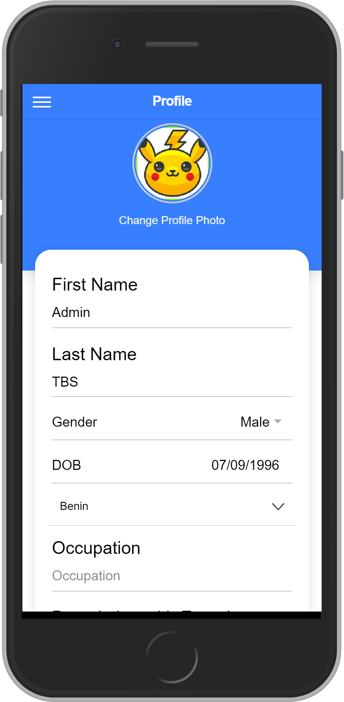

# Appointment

Appointments are an Application to manage schedules appointments for meetings, visits.

## Prerequisites
- [Ionic](https://ionicframework.com/docs/installation/cli/#install-the-ionic-cli)

## Clone Project
```
git clone https://github.com/tbs-raviashara/doctor-appointment.git
```
## Screenshots

 &nbsp;
 &nbsp;
 &nbsp;
 &nbsp;
 &nbsp;
 &nbsp;
 &nbsp;
 &nbsp;


## Start A Local Dev Server
```
ionic serve --open
```

## Add Android Platform
```
ionic cordova platform add android
```

### Build Project
```
ionic cordova build android
```

## Run Application
```
ionic cordova run android
```

### Clean Project
```
npm run clean
```